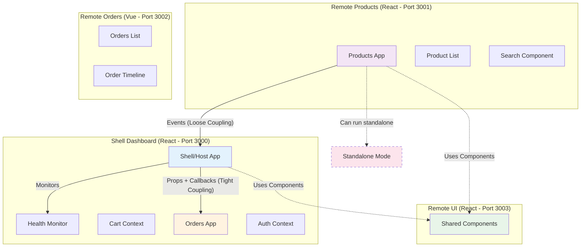

# Microfrontend Module Federation Lab

A production-ready demonstration of microfrontend architecture using **Module Federation** with **Vite**, showcasing real-world patterns for building scalable, independently deployable frontend applications.

## 🎯 What This Project Demonstrates

This lab explores advanced microfrontend concepts through a practical e-commerce demo with **four federated modules** communicating across **two frameworks** (React + Vue), implementing different coupling strategies, and featuring production-grade patterns like health monitoring and graceful error handling.

## 🏗️ Architecture Overview



## ✨ Key Features

### 🔧 **Module Federation with Vite**
- Runtime integration of independently deployed microfrontends
- Share dependencies without bundle duplication
- Hot module replacement across federated modules

### 🎨 **Multi-Framework Support**
- **React** (Shell, Products, UI)
- **Vue 3** (Orders) with Composition API
- Seamless interop between frameworks

### 🔗 **Communication Patterns**
- **Events** (Products → Shell): Loose coupling for independent modules
- **Props/Callbacks** (Shell ↔ Orders): Tight coupling for dependent modules
- Demonstrates trade-offs between coupling strategies

### 🚀 **Standalone Mode**
- Products module can run independently without the shell
- Environment-based configuration for development flexibility
- Conditional feature rendering based on context

### 📦 **Shared Component Library**
- Universal UI components federated from `remote-ui`
- Single source of truth for design system
- Independent updates without consumer redeployment

### 🏥 **Health Monitoring**
- Real-time health checks for all remote modules
- Response time tracking
- Visual status indicators with system-wide alerts

### 🛡️ **Production-Ready Patterns**
- Error boundaries with fallback UI
- Loading skeletons for better UX
- Authentication persistence with localStorage
- TypeScript throughout for type safety

## 📁 Project Structure

```
microfrontend-module-federation-lab/
├── shell-dashboard/          # Host application (React + Vite)
│   ├── src/
│   │   ├── components/       # RemoteHealthCheck, ErrorBoundary, etc.
│   │   ├── context/          # CartContext, OrderContext, AuthContext
│   │   ├── pages/            # Dashboard, Products, Orders, UIShowcase
│   │   └── hooks/            # Custom hooks for remote integration
│   └── vite.config.ts        # Exposes: N/A (host only)
│
├── remote-products/          # Products microfrontend (React + Vite)
│   ├── src/
│   │   ├── components/       # ProductCard, ProductList, Search
│   │   └── ProductsApp.tsx   # Main entry point
│   ├── .env                  # Federated mode config
│   ├── .env.standalone       # Standalone mode config
│   └── vite.config.ts        # Exposes: ProductsApp
│
├── remote-orders/            # Orders microfrontend (Vue 3 + Vite)
│   ├── src/
│   │   ├── components/       # OrderCard, OrderTimeline (Vue)
│   │   ├── Orders.vue        # Main component
│   │   └── mount.ts          # Vue mounting logic
│   └── vite.config.ts        # Exposes: OrdersApp
│
└── remote-ui/                # Shared UI library (React + Vite)
    ├── src/components/ui/    # Button, Card, Popover, Toast
    └── vite.config.ts        # Exposes: Button, Card, Popover, Toast
```

## 🎯 Shell Responsibilities

The **shell-dashboard** acts as the host application and orchestrates the entire system:

- **🔐 Authentication**: Manages user login/logout with demo authentication (localStorage-based)
- **🗺️ Routing**: Handles all application routes using React Router
- **🛒 Global State**: Maintains cart and order state across remotes
- **📡 Remote Integration**: Loads and coordinates all microfrontend modules
- **🏥 Health Monitoring**: Tracks availability and response times of all remotes
- **🎨 Layout**: Provides consistent navigation, header, and page structure

> The shell is the "orchestrator" - it doesn't implement business logic but provides the infrastructure for remotes to function together.

## 🔄 Communication Patterns in Detail

### Products → Shell (Events - Loose Coupling)
```typescript
// Products emits event
window.dispatchEvent(new CustomEvent('product:addToCart', {
  detail: { product }
}))

// Shell listens for event
window.addEventListener('product:addToCart', handleAddToCart)
```
Products can function independently and doesn't rely on Shell's existence.

### Shell ↔ Orders (Props/Callbacks - Tight Coupling)
```typescript
// Shell passes data and callbacks to Orders
<OrdersWrapper
  orders={orders}
  onStatusChange={updateOrderStatus}
/>
```
Orders depend on Shell for data and don't make sense as standalone.

## 🛠️ Tech Stack

| Layer | Technology |
|-------|-----------|
| **Build Tool** | Vite 6+ |
| **Module Federation** | @originjs/vite-plugin-federation |
| **Frameworks** | React 18, Vue 3 |
| **Language** | TypeScript |
| **Styling** | Tailwind CSS |
| **UI Components** | Custom + shadcn/ui inspired |
| **Routing** | React Router v6 |
| **Icons** | Lucide React |

## 🚀 Getting Started

### Prerequisites
```bash
Node.js >= 18
npm or yarn
```

### Run All Modules (Recommended)

> **Note**: Remotes must be built and served via preview for Module Federation to work correctly.

**Terminal 1 - Remote UI:**
```bash
cd remote-ui
npm install
npm run build
npm run preview
# Serves on http://localhost:3003
```

**Terminal 2 - Remote Products:**
```bash
cd remote-products
npm install
npm run build
npm run preview
# Serves on http://localhost:3001
```

**Terminal 3 - Remote Orders:**
```bash
cd remote-orders
npm install
npm run build
npm run preview
# Serves on http://localhost:3002
```

**Terminal 4 - Shell Dashboard:**
```bash
cd shell-dashboard
npm install
npm run dev
# Runs on http://localhost:3000
```

Then open **http://localhost:3000** and login.

**Quick Start Script:**
```bash
# Run this in the project root to build all remotes
(cd remote-ui && npm run build && npm run preview) &
(cd remote-products && npm run build && npm run preview) &
(cd remote-orders && npm run build && npm run preview) &
sleep 5 && cd shell-dashboard && npm run dev
```

### 🎪 Run Products Standalone (Demonstrates Loose Coupling)

One of the key benefits of the **event-based communication pattern** is that modules can run independently:

```bash
cd remote-products
npm run dev:standalone
# Runs on http://localhost:3001
```

**What's Different in Standalone Mode:**
- ✅ **Product catalog works** - Browse and search products
- ✅ **Independent operation** - No shell required
- ❌ **Cart functionality hidden** - Depends on shell context
- ❌ **No order placement** - Requires shell's order management

**Why This Matters:**
- 🔓 **Flexibility** - Products team can develop/test without running the entire system
- 🚀 **Implementation Freedom** - Could swap Products with a completely different implementation (Angular, Svelte, etc.) as long as it emits the same events
- 🔗 **Loose Coupling** - Products doesn't know about or depend on the shell's existence
- 🎯 **Team Autonomy** - Products team owns their domain completely

> **Contrast with Orders**: The Orders module uses props/callbacks and *cannot* run standalone because it's tightly coupled to the shell's state management. This is an intentional design choice - Orders don't make sense without a shopping context.

## 🎯 Interesting Implementation Details

### 1. **Cross-Framework Integration**
The Vue Orders module is mounted dynamically in React:
```typescript
import('orders/OrdersApp').then(module => {
  module.default.mount(containerRef.current, { orders, onStatusChange })
})
```

### 2. **Conditional Remote Features**
Products module adapts based on environment:
```typescript
const isStandalone = import.meta.env.VITE_STANDALONE === 'true'
const cartItems = isStandalone ? [] : useCartItems()
```

### 3. **Health Monitoring**
Each remote's availability is checked via HEAD requests:
```typescript
const response = await fetch(remote.url, { method: 'HEAD' })
const status = response.ok ? 'online' : 'offline'
```

### 4. **Error Isolation**
React Error Boundaries prevent one remote's failure from crashing the entire app:
```typescript
<ErrorBoundary fallback={<ProductsFallback />}>
  <Suspense fallback={<ProductsSkeleton />}>
    <ProductsWrapper />
  </Suspense>
</ErrorBoundary>
```

## 📚 What You'll Learn

- How to configure Vite for Module Federation
- Exposing and consuming remote modules at runtime
- Integrating multiple frameworks in one application
- Implementing different communication patterns
- Building standalone vs. federated module modes
- Sharing component libraries across microfrontends
- Production patterns: error handling, health monitoring
- TypeScript across federated boundaries
- Handling authentication and state management in distributed apps

## 🎨 Demo Features

- **Dashboard**: Health monitoring and quick navigation
- **Products**: Searchable product catalog with cart integration
- **Orders**: Order management with status tracking (Vue)
- **UI Components**: Interactive component library showcase

## 🔍 Testing Resilience

**Test offline detection:**
1. Stop the `remote-products` server (Ctrl+C)
2. Navigate to Products page
3. See error boundary with fallback UI
4. Dashboard shows Products as "offline"

**Test standalone mode:**
1. Run Products in standalone mode
2. Notice cart button is hidden
3. Module functions independently

## 📝 Notes

- **Development Only**: This demo uses Vite's dev server. Production requires proper build/deployment strategy.
- **Port Configuration**: Ensure ports 3000-3003 are available.
- **Module Loading**: First load of remotes may be slow due to federation overhead.
- **React StrictMode**: Intentionally enabled to demonstrate proper effect handling.

